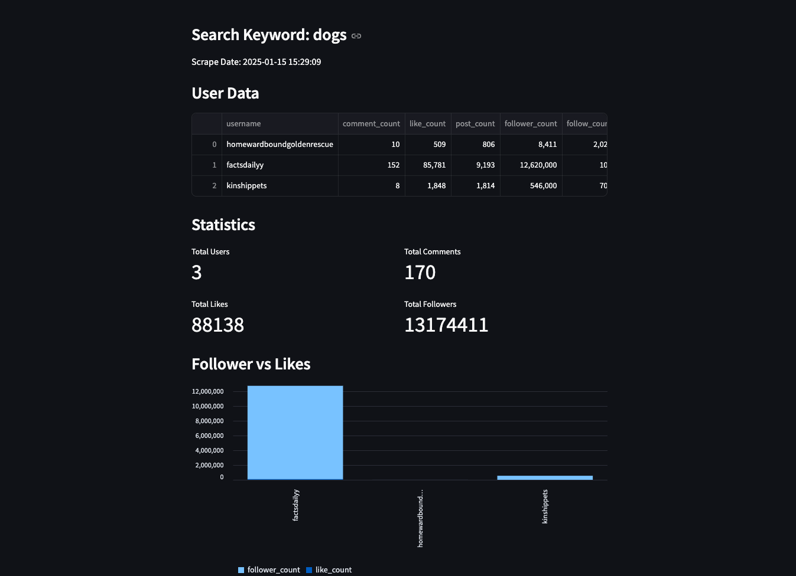

[//]: # ([![forthebadge]&#40;https://forthebadge.com/images/badges/open-source.svg&#41;]&#40;https://forthebadge.com&#41;)

[](https://forthebadge.com)
[](https://forthebadge.com)

Instagram Scraper 
=======================
This tool is designed to scrape data from Instagram. It utilizes the Selenium library to perform web scraping and extract information directly from Instagram without relying on the Instagram API.
Additionally, it provides a Streamlit-powered dashboard for visualizing the scraped data in a user-friendly interface.



## Prerequisite
- python >= 3.10 

## Installation

1. Clone this repository

2. Move to the project directory
   
3. Install the required Python packages:
    ```bash
    pip install -r requirements.txt
   ```

## How to Use:

To use this script, follow these steps:

### 1. Set up Configuration (config.ini)
- You need to configure the necessary settings in the {project}/config/config.ini file.
- Set "timout_sec" appropriately to prevent infinite loading.
- Set the maximum number of video to scrape with the "video_limit_cnt" setting.
- If you need proxy settings, put them in "proxy_server"
- For instagram, you need to put account info in INSTAGRAM section

### 2. Run the script with Python:
  ```bash 
    python main.py --keyword "Search Keyword"  --output <Output File Path>
    # If you want to include the dashboard additionally:      
    python main.py --keyword "Search Keyword"  --output <Output File Path> --dashboard
  ```

## Caution
- If you use a proxy, you may be required to provide an authentication code after logging in. This code will typically be sent via email or phone.
- There is a risk of the account being blocked.
- As a result, this script may not be suitable for full automation and is better used for single transactions.

## Update
- 2025.01.15 : Initial implementation started.

## Contact

For any feedback or queries, please reach out to me at [kimyk0120@gmail.com](kimyk0120@gmail.com).

[](https://www.buymeacoffee.com/kimyk0120)